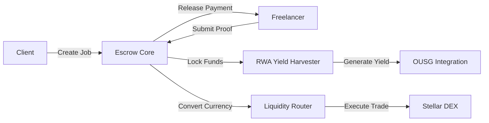

<div align="center">

# 💸 FlowPay

**Next-Generation Decentralized Payroll Infrastructure on Stellar**

[](https://stellar.org)
[](https://soroban.stellar.org)
[](https://reactjs.org)
[](https://www.typescriptlang.org)

[Features](#-features) • [Quick Start](#-quick-start) • [Architecture](#-architecture) • [Documentation](#-documentation)

</div>

---

## 🌟 Overview

**FlowPay** is a production-ready decentralized payroll protocol that revolutionizes freelance payments through blockchain technology. Built on Stellar's Soroban platform, FlowPay combines trustless escrow, Real-World Asset (RWA) yield generation, and instant cross-currency settlements to create a seamless payment experience for clients and freelancers worldwide.

### Why FlowPay?

- 🔒 **Trustless Escrow**: Smart contracts eliminate payment disputes and ensure fair compensation
- 💰 **Earn While You Wait**: Generate 5%+ APY on locked funds through OUSG RWA integration
- ⚡ **Lightning Fast**: Sub-5 second transaction finality on Stellar
- 🌍 **Global Payments**: Automatic currency conversion (USDC → INR and more)
- 📊 **Transparent**: On-chain proof of work verification via GitHub PRs or documents
- 💎 **Low Cost**: Sub-cent transaction fees

---

## ✨ Features

### For Clients
- **Smart Contract Job Creation**: Define milestones with automated release conditions
- **Proof Verification**: Review GitHub PRs or uploaded documents before approving payments
- **Multi-Milestone Support**: Break projects into 1-3 trackable milestones
- **Real-Time Monitoring**: Dashboard showing all active jobs and completion status
- **Cross-Currency Payments**: Pay in USDC, freelancer receives in INR (or other local currencies)

### For Freelancers
- **Guaranteed Payment**: Funds locked in escrow at job creation
- **Passive Yield**: Earn RWA yield on locked payments while working
- **Flexible Proof**: Submit GitHub PR links or document URLs as work proof
- **Instant Withdrawals**: Claim approved payments in your preferred currency
- **Portfolio Tracking**: View all assigned jobs and earnings history

### Technical Features
- **RWA Yield Harvester**: Integration with Ondo Finance OUSG tokens for yield generation
- **Liquidity Router**: Automated currency conversion using Stellar DEX
- **Proof of Work System**: On-chain verification of deliverables
- **Wallet Integration**: Seamless Freighter wallet connectivity
- **Responsive UI**: Beautiful dark mode interface optimized for all devices

---

## 📁 Project Structure

```
flowpay/
├── contracts/                           # Soroban Smart Contracts (Rust)
│   ├── escrow_core/                     # Main escrow logic & milestone management
│   │   ├── src/
│   │   │   └── lib.rs                   # Core contract implementation
│   │   └── Cargo.toml
│   ├── rwa_yield_harvester/             # RWA yield calculation & OUSG integration
│   │   ├── src/
│   │   │   └── lib.rs                   # Yield harvesting logic
│   │   └── Cargo.toml
│   └── liquidity_router/                # Cross-currency conversion via Stellar DEX
│       ├── src/
│       │   └── lib.rs                   # Currency routing logic
│       └── Cargo.toml
├── frontend/                            # React Web Application
│   ├── src/
│   │   ├── components/
│   │   │   ├── Landing.tsx              # Landing page with wallet connection
│   │   │   ├── ClientDashboard.tsx      # Client job management interface
│   │   │   ├── FreelancerDashboard.tsx  # Freelancer job/earnings view
│   │   │   ├── JobCreationForm.tsx      # Multi-step job creation wizard
│   │   │   ├── TransactionModal.tsx     # Transaction status & confirmations
│   │   │   └── ProofSubmission.tsx      # Work proof submission interface
│   │   ├── hooks/
│   │   │   └── useTransactions.ts       # Custom hook for blockchain interactions
│   │   ├── lib/
│   │   │   └── stellar.ts               # Stellar SDK utilities & contract IDs
│   │   └── App.tsx
│   ├── package.json
│   └── vite.config.ts
└── README.md
```

---

## 🚀 Quick Start

### Prerequisites

Before you begin, ensure you have the following installed:

- **Rust** (latest stable) - [Install Rust](https://rustup.rs/)
- **Soroban CLI** - Install via `cargo install stellar-cli`
- **Node.js** (v18+) - [Download Node.js](https://nodejs.org/)
- **Freighter Wallet** - [Browser Extension](https://www.freighter.app/)

### 1️⃣ Clone the Repository

```bash
git clone https://github.com/sukrit-89/Flowpay.git
cd Flowpay
```

### 2️⃣ Deploy Smart Contracts

#### Build Contracts

```bash
# Build escrow_core
cd contracts/escrow_core
soroban contract build

# Build rwa_yield_harvester
cd ../rwa_yield_harvester
soroban contract build

# Build liquidity_router
cd ../liquidity_router
soroban contract build
```

#### Deploy to Testnet

```bash
# Add wasm32 target if not already added
rustup target add wasm32-unknown-unknown

# Deploy escrow_core
soroban contract deploy \
  --wasm target/wasm32-unknown-unknown/release/escrow_core.wasm \
  --source <YOUR_SECRET_KEY> \
  --network testnet

# Deploy rwa_yield_harvester
soroban contract deploy \
  --wasm target/wasm32-unknown-unknown/release/rwa_yield_harvester.wasm \
  --source <YOUR_SECRET_KEY> \
  --network testnet

# Deploy liquidity_router
soroban contract deploy \
  --wasm target/wasm32-unknown-unknown/release/liquidity_router.wasm \
  --source <YOUR_SECRET_KEY> \
  --network testnet
```

> **Note**: Save the returned contract IDs - you'll need them for frontend configuration.

### 3️⃣ Configure Frontend

1. **Install dependencies:**

```bash
cd frontend
npm install
```

2. **Update contract addresses** in `src/lib/stellar.ts`:

```typescript
export const CONTRACT_IDS = {
  ESCROW_CORE: 'YOUR_DEPLOYED_ESCROW_CONTRACT_ID',
  RWA_YIELD_HARVESTER: 'YOUR_DEPLOYED_YIELD_CONTRACT_ID',
  LIQUIDITY_ROUTER: 'YOUR_DEPLOYED_ROUTER_CONTRACT_ID',
};
```

3. **Start development server:**

```bash
npm run dev
```

4. **Open browser** and navigate to `http://localhost:5173`

### 4️⃣ Connect Wallet & Start Using

1. Install Freighter wallet browser extension
2. Create a testnet account or import existing one
3. Fund your account via [Stellar Laboratory Friendbot](https://laboratory.stellar.org/#account-creator?network=test)
4. Connect wallet on FlowPay landing page
5. Start creating jobs (as client) or viewing assigned jobs (as freelancer)!

---

## 🏗️ Architecture

### Smart Contract Layer



### User Flow

#### Client Journey
1. **Connect Wallet** → Freighter authentication
2. **Create Job** → Define milestones, lock OUSG funds
3. **Monitor Progress** → Track freelancer submissions
4. **Approve Milestones** → Verify proof and release payments
5. **Earn Yield** → Accumulate returns on locked funds

#### Freelancer Journey
1. **Connect Wallet** → Freighter authentication
2. **View Jobs** → See all assigned contracts
3. **Submit Proof** → Upload GitHub PR or document URL
4. **Track Yield** → Monitor accumulated RWA returns
5. **Claim Payment** → Withdraw in preferred currency (USDC/INR)

---

## 🔧 Smart Contract Details

### Escrow Core Contract

**Primary Functions:**

| Function | Description | Parameters |
|----------|-------------|------------|
| `create_job()` | Initialize a new job with milestones | `client`, `freelancer`, `amount`, `milestones` |
| `submit_proof()` | Submit work verification for milestone | `job_id`, `milestone_index`, `proof_url` |
| `approve_milestone()` | Client approves and releases payment | `job_id`, `milestone_index` |
| `get_job()` | Retrieve job details and status | `job_id` |

### RWA Yield Harvester Contract

**Primary Functions:**

| Function | Description | Parameters |
|----------|-------------|------------|
| `calculate_yield()` | Compute RWA yield based on time/principal | `principal`, `duration` |
| `deposit_ousg()` | Deposit OUSG tokens for yield generation | `amount` |
| `redeem_to_usdc()` | Convert OUSG to USDC (1:1 on testnet) | `ousg_amount` |

### Liquidity Router Contract

**Primary Functions:**

| Function | Description | Parameters |
|----------|-------------|------------|
| `get_exchange_rate()` | Fetch current USDC → INR rate | `from_currency`, `to_currency` |
| `convert_and_send()` | Auto-convert and transfer funds | `amount`, `to_currency`, `recipient` |

---

## 🎨 Tech Stack

### Blockchain Layer
- **Stellar Blockchain**: Fast, low-cost settlement layer
- **Soroban Smart Contracts**: Rust-based smart contract platform
- **WASM**: WebAssembly compilation target
- **Ondo Finance OUSG**: Real-world asset yield generation

### Frontend Application
- **React 18**: Modern component-based UI
- **TypeScript**: Type-safe development
- **Vite**: Lightning-fast build tool
- **Tailwind CSS**: Utility-first styling framework
- **React Router DOM**: Client-side routing
- **Stellar SDK**: Blockchain interaction library

---

## 🌐 Deployment

### Smart Contracts (Production)

```bash
# Switch to mainnet for production deployment
soroban contract deploy \
  --wasm target/wasm32-unknown-unknown/release/escrow_core.wasm \
  --source <YOUR_MAINNET_SECRET_KEY> \
  --network mainnet
```

### Frontend Deployment

#### Vercel (Recommended)

```bash
# Install Vercel CLI
npm i -g vercel

# Build project
npm run build

# Deploy
vercel --prod
```

#### Netlify

```bash
# Build project
npm run build

# Deploy dist/ folder via Netlify CLI or dashboard
```

### Environment Variables

Create a `.env` file in the `frontend/` directory:

```env
VITE_STELLAR_NETWORK=testnet  # or 'mainnet' for production
VITE_ESCROW_CONTRACT=<YOUR_ESCROW_CONTRACT_ID>
VITE_YIELD_CONTRACT=<YOUR_YIELD_CONTRACT_ID>
VITE_ROUTER_CONTRACT=<YOUR_ROUTER_CONTRACT_ID>
```

---

## 🔐 Security

- ✅ **Wallet Signature Required**: All transactions require explicit user approval
- ✅ **Role-Based Access**: Client and freelancer authentication via Stellar accounts
- ✅ **Immutable Logic**: Smart contracts deployed on-chain, code cannot be modified
- ✅ **Open Source**: Fully auditable codebase
- ✅ **No Private Key Storage**: Keys managed exclusively by Freighter wallet

> **Production Recommendation**: Conduct a third-party smart contract audit before mainnet deployment.

---

## 📊 Protocol Statistics

| Metric | Value |
|--------|-------|
| **Transaction Speed** | < 5 seconds |
| **Gas Fees** | ~$0.0001 per transaction |
| **RWA APY** | 5%+ (OUSG) |
| **Supported Currencies** | USDC, INR (+ extensible) |
| **Milestone Limit** | 1-3 per job |

---

## 🛣️ Roadmap

- [ ] Multi-token support (USDT, XLM, etc.)
- [ ] Partial payment releases
- [ ] Dispute resolution mechanism
- [ ] Integration with additional RWA protocols
- [ ] Mobile app (React Native)
- [ ] Advanced analytics dashboard
- [ ] DAO governance for protocol upgrades

---

## 🤝 Contributing

We welcome contributions! Please follow these steps:

1. **Fork** the repository
2. **Create** a feature branch (`git checkout -b feature/amazing-feature`)
3. **Commit** your changes (`git commit -m 'Add amazing feature'`)
4. **Push** to the branch (`git push origin feature/amazing-feature`)
5. **Open** a Pull Request

### Development Guidelines
- Write tests for new features
- Follow existing code style (Prettier + ESLint)
- Update documentation for API changes
- Ensure all tests pass before submitting PR

---

## 📝 License

This project is licensed under the **MIT License** - see the [LICENSE](LICENSE) file for details.

---

## 🔗 Resources

- 📚 **[Stellar Documentation](https://developers.stellar.org/)**
- 🔧 **[Soroban Smart Contracts](https://soroban.stellar.org/)**
- 🌐 **[Stellar Laboratory](https://laboratory.stellar.org/)** (Testnet Tools)
- 💼 **[Freighter Wallet](https://www.freighter.app/)**
- 🏦 **[Ondo Finance](https://ondo.finance/)** (OUSG RWA Provider)

---

## 📧 Support

- **Issues**: [GitHub Issues](https://github.com/sukrit-89/Flowpay/issues)
- **Discussions**: [GitHub Discussions](https://github.com/sukrit-89/Flowpay/discussions)

---

<div align="center">

**Built with ❤️ for the Stellar Ecosystem**

⭐ **Star this repo if FlowPay helps you!** ⭐

</div>
